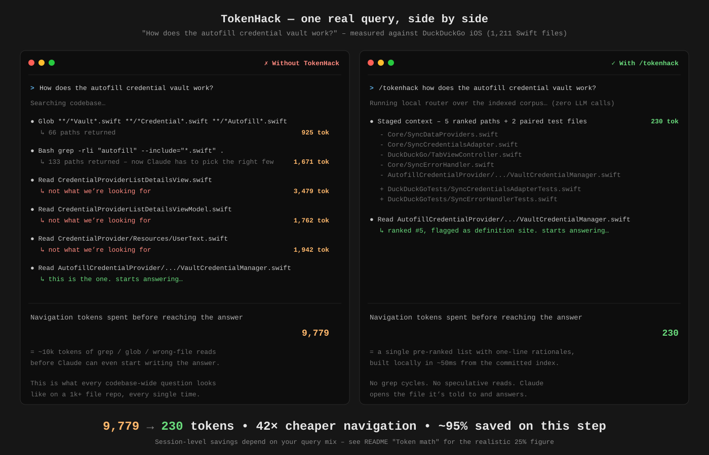

# TokenHack

### Hitting your daily Claude usage limit before lunch?
### TokenHack cuts ~95% of the tokens your AI assistant spends just finding the right files in your codebase. Drop-in skill, no install, no SaaS.



---

## The problem

If you've spent any real time using Claude Code, Cursor, or any other AI coding assistant on a serious codebase, you've probably noticed the pattern. You ask something like *"how does our cart sync to the backend?"* or *"where do we handle rate limiting?"*, and before the assistant can answer, it goes on a small expedition through your tree. It runs `grep` a few times, opens five or six files, decides most of them are the wrong ones, opens more. By the time you get an answer, a few thousand tokens have already been spent on the search itself — not on the work.

On a side project, that doesn't matter. On a mature codebase with hundreds or thousands of files, it adds up fast. If your organisation puts usage caps on those tools, you'll hit them in the middle of work that actually matters. And every grep-and-read cycle is time you're staring at a spinner instead of getting an answer.

TokenHack exists to fix that, specifically for the cases where it matters.

---

## What TokenHack is

TokenHack is a small skill that lives inside your repository, right next to your code. When you ask the assistant a codebase-wide question, it quietly hands over a pre-ranked list of the files most likely to contain the answer — *before* the assistant does any exploration. The assistant reads those five-or-so files and answers, instead of fumbling around your tree.

Three things keep it cheap to adopt:

- **No model.** No embeddings, no semantic search, no LLM doing the retrieval. It's plain Python doing careful structured matching.
- **No service to run.** Nothing to deploy, no credentials to manage, no SaaS to plug into your VPC.
- **Nothing for developers to install.** The retrieval engine ships with the skill itself, and runs in pure standard-library Python. The one heavyweight piece — building the index — runs in CI, not on anyone's laptop.

If your team is small, your repo fits comfortably inside the assistant's context window, or you're working greenfield, you probably don't need this yet. TokenHack is built for the people who are quietly drowning in token usage on large, mature codebases.

---

## How it builds the index

The first time you set it up — and on every push afterwards — an *indexer* walks through your code and writes down what it finds. Every function, every class, every imported module, every docstring, and which files import which other files. All of that goes into a structured JSON file under `.claude/skills/tokenhack/index/`, which gets committed to your repo right alongside your code.

The mental model is the index at the back of a textbook. It's not a search engine. It doesn't understand what your code *does*. It's just a list of what's where, written down once so the assistant doesn't have to flip through the whole book every time it wants to find something.

To extract that list, the indexer uses [tree-sitter](https://tree-sitter.github.io/tree-sitter/) — a parser that actually understands code structure rather than just pattern-matching text. Out of the box, it handles Python, Java, Kotlin, JavaScript/JSX, and Swift. Files in unsupported languages are skipped without breaking the build; the rest of the index still gets written.

---

## How it picks the right files for your question

This is the part that would normally take a machine-learning model, and TokenHack deliberately doesn't use one. Instead, the router (also pure Python, no dependencies) scores every file in the index against your question, combining a handful of plain signals:

**Matching the words themselves.** This is the obvious one: does the file contain the words from your question? Files where the words appear more often, especially in important places like a function or class name rather than a buried comment, score higher.

There's one trick worth calling out. Programmers don't usually write `user_profile` in English — they write `getUserProfile` or `UserProfileView`. So before matching, the router splits those CamelCase and snake_case names back into their pieces. A natural-language question about *"user profile"* finds `getUserProfile` even though those exact words appear nowhere in the file.

**Where the words appear.** A match in a filename beats a match buried in the middle of a comment. A match in the file's directory path (`payments/retry/idempotency.py` for a question about idempotency) is a strong hint that you're in the right neighbourhood.

**Recency.** A file that changed last week is more likely to be relevant to whatever you're working on today than one that nobody's touched in two years. This is a tie-breaker, not a primary signal — once everything else is equal, prefer recent.

**How things connect.** If file A defines something your question is about, and file B imports A, then B is probably worth a look too. The router walks the import graph one or two hops out from each strong match, so neighbouring code surfaces naturally.

**"Callers of X" gets a dedicated mode.** If your question looks like *"who calls AddToCartButton?"* or *"where is fetchUser used?"*, the router recognises the intent, locates the file that defines `AddToCartButton`, walks the reverse import graph, and returns the files that actually use it. This is the kind of question that's painful to grep for by hand.

What's deliberately *missing* from all this — and what keeps the engine small — is anything that would require a machine-learning model: no embeddings, no semantic similarity, no neural reranking. The full set of tunable scoring constants lives in [`.claude/skills/tokenhack/README.md`](.claude/skills/tokenhack/README.md). If your team finds better defaults, open a PR.

---

## How the index stays fresh

You don't want to manually rebuild the index every time you push a change — that's exactly the friction TokenHack is meant to remove. So the rebuild runs in CI.

The provided GitHub Actions workflow watches your `main` branch. On every push that isn't itself an index update (the bot ignores its own commits, so you don't get loops), it spins up a clean Python environment, rebuilds the index, and commits the new version back to your repo.

Two design choices keep this fast even on large repositories:

- **Incremental rebuilds.** Only files whose content actually changed get re-parsed. A push that touches three files rebuilds three entries, not the whole 1,400-file index.
- **A freshness stamp.** Every `/tokenhack` invocation tells the assistant when the index was last rebuilt, and warns if too many files have changed since. So if you're working on code that landed minutes ago, you'll know to grep instead of trusting a stale answer.

GitLab CI, CircleCI, and Jenkins workflows are in the install section below. The pattern is identical everywhere: rebuild on push, commit if anything changed, ignore the bot's own commits.

---

## How to use it

Once it's installed, you type `/tokenhack` followed by your question:

```
/tokenhack How does the payment retry queue handle idempotency conflicts?
```

The assistant receives a short block that looks roughly like this:

```
[tokenhack: index built 2026-05-25, 1004 files indexed]

Staged context for: How does the payment retry queue handle idempotency conflicts?

  - core/payments/retry_queue.py  (matches 'retry, queue'; strong filename match; definition site)
  - core/payments/idempotency.py  (matches 'idempotency'; strong filename match; definition site)
  - core/payments/__init__.py  (via import graph)
  - ...

Paired test files:
  - tests/payments/test_retry_queue.py  (test for core/payments/retry_queue.py)
```

Then it answers your question using those files. No detective work, no wasted greps.

After the first invocation in a session, the assistant will gently offer to re-stage on future codebase-wide questions. If you don't want that, say *"just answer"* once and it stops nudging for the rest of the session.

---

## Install — 3 steps

### Step 1. Copy the skill directory into your repo

```bash
# from your project's repo root:
git clone https://github.com/rahulr85r/TokenHack.git /tmp/tokenhack
cp -R /tmp/tokenhack/.claude/skills/tokenhack ./.claude/skills/
```

Or just download the [latest release](https://github.com/rahulr85r/TokenHack/releases) and copy the `.claude/skills/tokenhack/` directory.

### Step 2. Add one line to your project's `CLAUDE.md`

Open (or create) `CLAUDE.md` at your repo root and add this single line:

```markdown
For codebase-wide questions, use `/tokenhack <question>` first to pre-stage context.
```

That's ~20 tokens loaded once per Claude Code session — Claude itself will then suggest `/tokenhack` to your developers when their question looks codebase-wide.

### Step 3. Wire up CI to keep the index fresh

#### GitHub Actions (recommended path)

Copy the workflow from this repo into yours:

```bash
mkdir -p .github/workflows
cp /tmp/tokenhack/.github/workflows/tokenhack-index.yml .github/workflows/
```

**One-time repo setting:** GitHub → Settings → Actions → General → **Workflow permissions** → set to *"Read and write permissions"*. This lets the workflow commit the rebuilt index back to your repo.

**First-time seed.** Run the indexer locally once to seed an initial index so `/tokenhack` works before CI catches up:

```bash
python3 -m venv .tokenhack-venv
source .tokenhack-venv/bin/activate
pip install -r .claude/skills/tokenhack/requirements.txt
python3 .claude/skills/tokenhack/indexer.py
deactivate
git add .claude/skills/tokenhack/index/
git commit -m "Seed TokenHack index"
git push
```

After this initial seed, CI takes over and rebuilds the index automatically on every push.

**How the workflow protects against recursive triggers.** The provided workflow uses `paths-ignore: ['.claude/skills/tokenhack/index/**']`, so the bot's own index commit doesn't trigger another rebuild.

#### GitLab CI

```yaml
# .gitlab-ci.yml
tokenhack-index:
  stage: build
  only:
    refs: [main]
    changes_not:
      - .claude/skills/tokenhack/index/**
  image: python:3.11
  script:
    - pip install -r .claude/skills/tokenhack/requirements.txt
    - python3 .claude/skills/tokenhack/indexer.py
    - |
      if [ -n "$(git status --porcelain .claude/skills/tokenhack/index/)" ]; then
        git config user.email "ci@example.com"
        git config user.name "GitLab CI"
        git add .claude/skills/tokenhack/index/
        git commit -m "[tokenhack] update index"
        git push https://gitlab-ci-token:${CI_PUSH_TOKEN}@$CI_SERVER_HOST/$CI_PROJECT_PATH.git HEAD:$CI_COMMIT_REF_NAME
      fi
```

(Requires a `CI_PUSH_TOKEN` CI/CD variable with write access — GitLab uses Personal Access Tokens or Project Access Tokens.)

#### CircleCI

```yaml
# .circleci/config.yml — relevant job
jobs:
  tokenhack-index:
    docker:
      - image: cimg/python:3.11
    steps:
      - checkout
      - run:
          name: Rebuild index
          command: |
            pip install -r .claude/skills/tokenhack/requirements.txt
            python3 .claude/skills/tokenhack/indexer.py
      - run:
          name: Commit if changed
          command: |
            if [ -n "$(git status --porcelain .claude/skills/tokenhack/index/)" ]; then
              git config user.email "ci@example.com"
              git config user.name "CircleCI"
              git add .claude/skills/tokenhack/index/
              git commit -m "[tokenhack] update index"
              git push origin $CIRCLE_BRANCH
            fi
```

(Requires a deploy key or token with push access on the repo.)

#### Jenkins

```groovy
pipeline {
  agent { docker { image 'python:3.11' } }
  stages {
    stage('Rebuild index') {
      steps {
        sh 'pip install -r .claude/skills/tokenhack/requirements.txt'
        sh 'python3 .claude/skills/tokenhack/indexer.py'
      }
    }
    stage('Commit') {
      when { branch 'main' }
      steps {
        sh '''
          if [ -n "$(git status --porcelain .claude/skills/tokenhack/index/)" ]; then
            git config user.email "ci@example.com"
            git config user.name "Jenkins"
            git add .claude/skills/tokenhack/index/
            git commit -m "[tokenhack] update index"
            git push origin HEAD:main
          fi
        '''
      }
    }
  }
}
```

(Requires a Jenkins credential with git push access.)

---

## Token math

On every `/tokenhack` invocation, the router emits roughly:

- **Header line** — index freshness + file count (~5 tokens, always present)
- **Top-K results** — paths + one-line "why" (~3-5 tokens × 5 = ~20 tokens)
- **Conditional warnings** — low-confidence / stale-index (~10 tokens each, only when triggered)
- **Test pair section** — when applicable (~5 tokens per pair)

**Worst case: ~45 tokens. Average: ~25 tokens.** Versus a typical codebase-wide question where Claude grep-explores 5-15 files at hundreds-to-thousands of tokens each, the net savings are usually 10-50× on the question itself.

### What that looks like in practice

Measured on one real query — *"how does the autofill credential vault work"* against the [DuckDuckGo iOS](https://github.com/duckduckgo/iOS) repo (1,211 Swift files):

| | Tokens | What it is |
|---|---:|---|
| **With TokenHack** | **~230** | The staged-context block: 5 ranked paths + rationales + 2 paired test files |
| **Without TokenHack** | **~9,800** | What Claude burns finding the right files: `glob` candidates (~925) + `grep -rli autofill` (~1,670) + ~7,180 wasted speculative reads of wrong files |

**~95% savings on the navigation step alone**, for that one question.

### What that means across a real session

TokenHack doesn't *read* files for Claude — it tells Claude *which* files to read. So the once-you-have-the-right-files cost is the same either way. The savings come from skipping the speculative grep-and-read-wrong-file cycle.

Realistic session-level savings depend on your query mix:

| Session pattern | TokenHack-applicable share | Realistic session-token savings |
|---|---:|---:|
| Mostly "edit this displayed function" / local follow-ups | ~10% | **2–5%** |
| Mixed exploration + edits (typical engineer on a mature repo) | ~40% | **~25%** |
| Onboarding to a large unfamiliar codebase ("where does X live", "trace Y") | ~80% | **40%+** |

The honest single number for the case TokenHack was built for — a working engineer on an existing large codebase — is **~25% session-level token savings**, with **~95% on each individual navigation step**.

### When TokenHack does *not* help

It is **deliberately useless** for:

- **"Fix this line / rename this var / add a comment to the function above"** — there's no codebase to explore; Claude is acting on code already in the conversation.
- **Generic language or algorithm questions** unrelated to your repo.
- **Stack-trace debugging where the file:line is already known** — Claude greps from the trace directly, which it does well.
- **Trivial follow-ups to the immediately previous turn** (*"now do the same for foo"*).

The three-gate nudge ruleset (next section) is what keeps the skill silent in these cases — false positives are strictly worse than missed nudges. If you only ever do local edits, TokenHack will save you essentially nothing, and that's by design.

---

## The three-gate nudge ruleset

After `/tokenhack` is invoked once in a session, Claude is instructed to suggest re-invoking it only when **all three** of the following gates pass:

1. **Scope signal present.** The question contains cross-cutting language (*find all*, *where*, *trace*), architectural framing, existence checks, or a domain concept with no specific symbol named.
2. **No local anchor.** The question doesn't name a file/symbol already in the conversation, doesn't pronoun-refer to the previous turn, isn't a generic language question, and isn't a trivial edit.
3. **Worth the round-trip.** The question is substantive *and* would require Claude to read ~3+ unseen files.

When in doubt, Claude is told to NOT nudge — false positives are strictly worse than missed nudges. The user can always invoke `/tokenhack` manually.

The exact ruleset is in [`.claude/skills/tokenhack/SKILL.md`](.claude/skills/tokenhack/SKILL.md). It's natural-language instructions to Claude, not regex — community-tunable.

---

## Honest limitations

- **Coreference depth-2+.** "And the same for the Stripe one" referring to a refactor two turns back will leak through Gate 2 — the rule only catches immediate-previous-turn pronouns.
- **Project jargon.** "Fix the SSO bug" looks scoped to one symbol but may span 20 files. Users must invoke `/tokenhack` manually for these.
- **Stack-trace debugging.** Looks local (file:line given) but root cause may be elsewhere. By design we don't nudge here — let Claude grep from the trace, which it does well.
- **Multi-language repos.** The matching logic is language-agnostic but can't disambiguate "the controller" → Rails vs Spring vs NestJS.
- **Auto-invocation is probabilistic.** Claude follows the skill body's nudge rules most of the time, not deterministically. The escape hatch exists precisely so misfires don't accumulate.
- **First-time discovery.** Developers don't know `/tokenhack` exists until they read the README, see it in the `/` slash menu, or are nudged by Claude (after at least one prior invocation in the session, or via the `CLAUDE.md` hint). Org onboarding helps.

---

## Contributing

TokenHack is intentionally small, single-purpose, and stdlib-only on the dev side. PRs welcome — see [`.claude/skills/tokenhack/README.md`](.claude/skills/tokenhack/README.md) for adapter internals.

**Sharply scoped first-PR opportunities** (each is a few hours of work and has a clear, testable surface):

- **TypeScript adapter.** Extend `adapters/javascript.py` to handle `.ts` and `.tsx`. The grammars share ~95% of node types. *(Highest-impact contribution — the majority of modern React / Vue codebases.)*
- **Vue.js adapter.** Add `adapters/vue.py` using `tree-sitter-vue` to handle `.vue` SFCs. Reuse the JS/TS adapter internally for `<script>` blocks.
- **Ruby adapter.** `tree-sitter-ruby`. Straightforward.
- **C# adapter.** `tree-sitter-c-sharp`. Heavy enterprise use.
- **Rust adapter.** `tree-sitter-rust`. CNCF / infra workloads.
- **Go adapter.** `tree-sitter-go`. Modern infra.

**Larger, scope-discussed-first contributions:**

- Multi-hop import graph beyond 2-hop (with safeguards against blow-up).
- Git-history co-occurrence as a relevance signal.
- Acronym expansion (JWT ↔ "json web token").
- Query intent classification (explanation vs modification vs search).
- Result diversification / top-K auto-tuning.

Open an issue first for the larger items — we can scope together before code.

**What stays out** (intentionally, to preserve the load-bearing constraints):

- Embeddings, cross-encoder rerankers, LLM-as-retriever — any of these would require a model artifact, a runtime install, or a network call. All three break "pure-stdlib router, zero per-dev install, no external tooling."

If you have an idea for a richer retrieval signal that fits these constraints, open an issue — happy to discuss.

---

## Why it's called TokenHack

Two senses:

1. **Hacking** in the *make-do-with-what-you-have* sense — using only stdlib + tree-sitter + careful structured matching to dramatically cut the tokens an AI assistant spends exploring a codebase.
2. **Hacking down** the token cost itself.

Not about security tokens.

---

## License

MIT — see [LICENSE](LICENSE).

## Author

Rahul R · [github.com/rahulr85r](https://github.com/rahulr85r)
